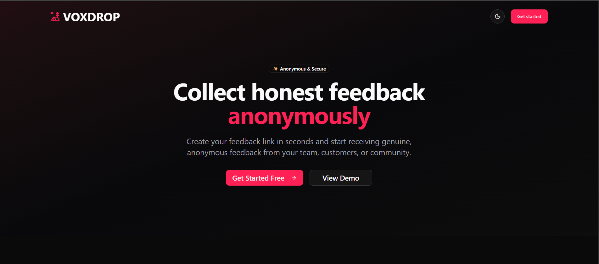
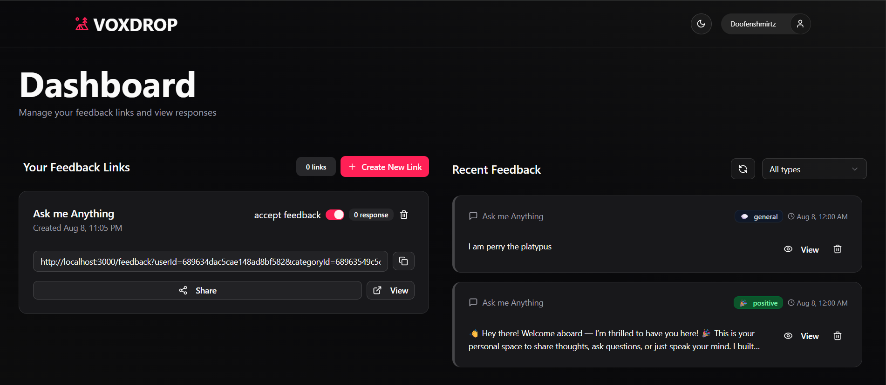
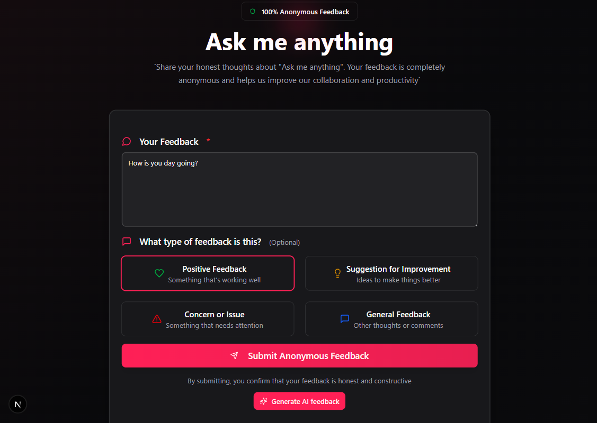

# VOXDROP


**VOXDROP** is a modern, privacy-focused **anonymous feedback platform** that empowers users to share honest opinions without revealing their identity.  
It’s designed for seamless usability, lightning-fast performance, and robust security — making it perfect for communities, workplaces, creators, and more.

---

## 🚀 Features

## 🖼️ Screenshots

**Homepage**  



**Category Management**  



**Give Feedback** 




### 🌟 Core Functionalities
- **Anonymous Feedback Submission** — Users can share feedback without logging in.
- **Category-based Feedback** — Organize and filter feedback by categories.
- **Real-time Updates** — Instant display of new feedback without refreshing.
- **Infinite Scroll** — Load feedback progressively for better performance and UX.
- **Initial Hydration** — Pre-rendered server data for faster first load and smooth client-side updates.
- **Secure Authentication** — Google/GitHub login for category owners to manage feedback.
- **Feedback Moderation** — Owners can accept/reject feedback visibility.
- **Shareable Links** — Easily share your feedback collection page with a single click.

### 📧 Communication
- **Email Notifications via Resend** — Get instant updates when new feedback arrives.
- **Customizable Email Templates** — Professionally styled notification emails.

### 🖥️ Technical Excellence
- Built with **Next.js 14** (App Router + Server Actions).
- **Shadcn/UI Components** — Clean, accessible, and responsive UI.
- **TanStack Query** — For client-side caching and state management.
- **Server-Side Rendering (SSR)** — For SEO and performance benefits.
- **TypeScript** — Type safety for reliable development.
- **MongoDB + Mongoose** — Efficient data storage and retrieval.
- **API Routes** — For secure and scalable backend operations.
- **Environment Variable Management** — `.env` setup for API keys and secrets.
---
## ⚙️ Installation & Setup

### 1️⃣ Clone the repository

```bash
git clone https://github.com/JosinJojy/voxdrop-feedback-app.git
cd voxdrop-feedback-app
npm install
```


